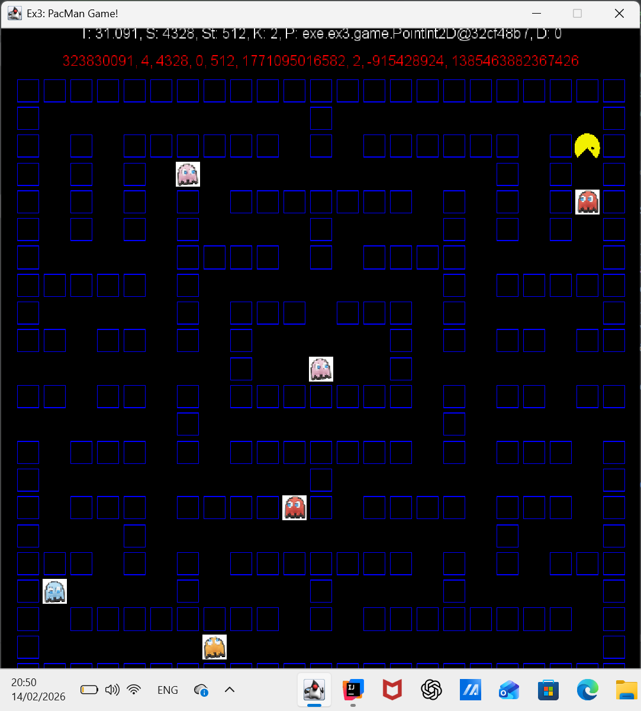
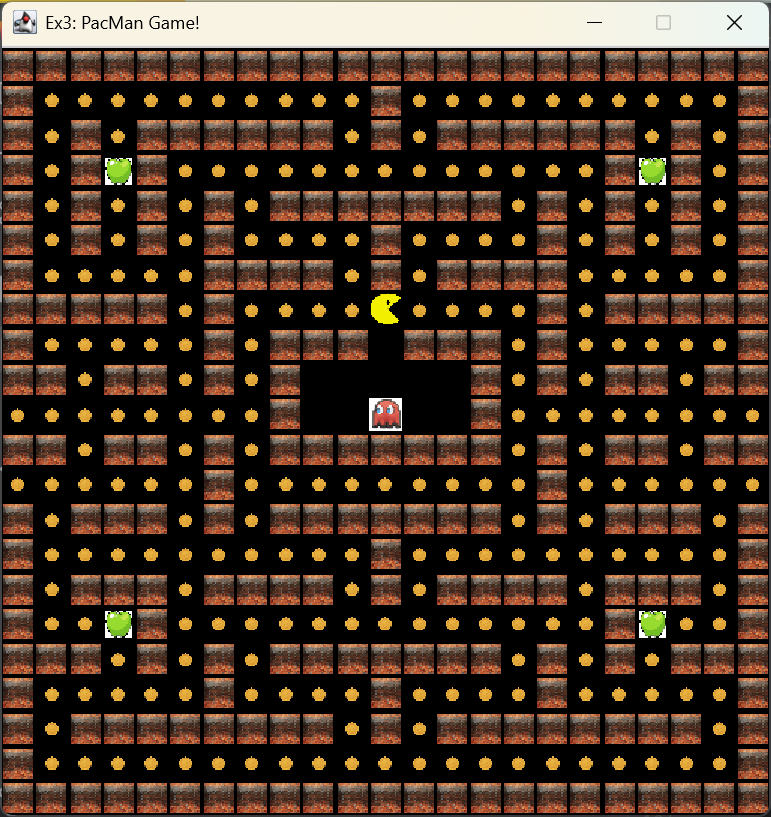

# Ex3 - Pacman Game Project

## 1. Overview
In this project, I implemented an autonomous Pacman using Java. My goal was to create an algorithm that navigates a maze, collects points (Coins and Apples), and intelligently avoids ghosts.

The core of my solution is in the `Ex3Algo` class. It uses a **BFS (Breadth-First Search)** algorithm to find the shortest path, combined with a "Safety First" approach.

---

## 2. The Main Loop
The logic runs inside the `move()` function. Every frame, I analyze the board and decide where to go.
Here is the main structure of my algorithm:

```
@Override
public int move(PacmanGame game) {
    // 1. Get current state and parse positions
    int[][] board = game.getGame(0);
    Pixel2D pacmanPos = parsePosition(game.getPos(0));

    // 2. Create "Virtual Walls" around ghosts for safety
    int[][] safeBoard = cloneBoard(board);
    markGhostsAsWalls(game, safeBoard, SAFETY_RADIUS);

    Map safeMap = new Map(safeBoard);

    // 3. Target Locking Logic (See section 4 below)
    if (_targetFood == null) {
        _targetFood = findBestFood(safeMap, pacmanPos);
    }

    // 4. Try to move using BFS on the Safe Map
    if (_targetFood != null) {
        Pixel2D[] path = safeMap.shortestPath(pacmanPos, _targetFood, 1);
        if (path != null && path.length > 1) {
            return getDirection(pacmanPos, path[1], board.length, board[0].length);
        }
    }

    // 5. Fallback: If trapped, run away!
    return emergencyEscape(game, new Map(board), pacmanPos);
}
```
3. The "Virtual Wall" Strategy
   To prevent Pacman from getting too close to ghosts, I don't just look at the ghost's current spot. I mark the entire area around the ghost as a "Wall".

This forces the pathfinding algorithm (BFS) to naturally plan a route that stays far away from danger.

```
private void markGhostsAsWalls(PacmanGame game, int[][] board, int radius) {
GhostCL[] ghosts = game.getGhosts(0);
if (ghosts == null) return;

    for (GhostCL g : ghosts) {
        Pixel2D gPos = parsePosition(g.getPos(0));
        int gx = gPos.getX();
        int gy = gPos.getY();
        
        // Loop around the ghost and set cells to WALL (1)
        for (int dx = -radius; dx <= radius; dx++) {
            for (int dy = -radius; dy <= radius; dy++) {
                int x = gx + dx; 
                int y = gy + dy;
                // (Boundary checks omitted for brevity)
                if (isValid(x, y)) { 
                    board[x][y] = 1; // 1 = WALL
                }
            }
        }
    }
}
```
4. Target Locking (Preventing Loops)
   I noticed a problem where Pacman would switch targets rapidly between two coins, causing him to "dance" in place.
   To fix this, I implemented a locking mechanism. Once a target is chosen, Pacman stays committed to it until it is eaten.

```
// Check if the locked target still exists
if (_targetFood != null) {
int targetVal = board[_targetFood.getX()][_targetFood.getY()];
// If target is empty (0) or wall (1), unlock it
if (targetVal <= 1) {
_targetFood = null;
}
}

// Only search for a NEW target if we don't have one
if (_targetFood == null) {
_targetFood = findBestFood(safeMap, pacmanPos);
}
```

5. Emergency Escape (Panic Mode)
   Sometimes, ghosts block all paths to food, or a ghost spawns right on top of Pacman. In these cases, BFS returns null.
   When this happens, my emergencyEscape function kicks in. It ignores food and simply calculates the direction that maximizes the distance to the nearest ghost.

```
private int emergencyEscape(PacmanGame game, Map map, Pixel2D pacmanPos) {
double maxDist = -1;
int bestDir = Game.UP;
int[] dirs = {Game.UP, Game.DOWN, Game.LEFT, Game.RIGHT};

    // Check all 4 directions
    for(int d : dirs) {
        Pixel2D next = nextPixel(pacmanPos, d, ...);
        
        if(map.getPixel(next) != 1) { // If valid move
            double dist = getDistanceToClosestGhost(next, ghosts);
            
            // Pick the move that takes us FURTHEST from danger
            if(dist > maxDist) {
                maxDist = dist;
                bestDir = d;
            }
        }
    }
    return bestDir;
}
```

MyGame.java
The main controller. It initializes the board from a string and manages the game loop. It connects the Ex3Algo to the StdDraw graphics.


Game score:


My server game


Short explanation
[](https://youtu.be/Qx9jyTlddwg)
